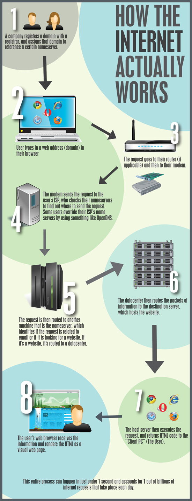

# How does the internet work?

The capabilities of the internet are almost limitless, as we're often shown by developers around the world. However at its simplest, its machines talking to machines via machines.

## Your machine and back again

I could write out the steps but there are thousands of great guides and images that will do a much better job then I can.

One such example:

Courtesy of: http://www.amazinginfographics.com/how-the-internet-works/

### IP Addresses

In a nut shell, everything has an [IP](../../GLOSSARY.md#ip) address that allows it to be located. However, [IP](../../GLOSSARY.md#ip) addresses aren't human friendly - nobody is going to remember that your website is hosted at `81.132.12.204`. It gets even worse if you want to use an IPv6 address (`2001:0db8:85a3:0000:0000:8a2e:0370:7334` anyone?). To help get around this, the internet uses `Domain Names`.

There are two versions of IP addresses, IPv4 and IPv6 (IP version 4 and IP version 6). IPv6 was introduced fairly recently and became an "internet standard" on 14 July 2017. IPv4 addresses are in the format `XXX.XXX.XXX.XXX` where XXX is any number between 0 and 255. Due to the growth of the internet, the range of IP addresses has had to be expanded to prevent every IP being used up (even though theres 2^32 / 4.3 billion addresses available using the v4 protocol) and this lead to the development of IPv6. As of writing this, IPv4 is still much more in use than IPv6 (to my eyes).

### Domain Names

A domain name in its simplest form is just a website name. The domain name is used as part of a [URL](../../GLOSSARY.md#url) to help locate a website. When you type in `www.google.com` into your browser, you are typing a domain name. The browser automatically adds a protocol to that to form the URL and then your request is sent off. The domain name is looked up against a domain name server ([DNS](../../GLOSSARY.md#dns)) where it finds the IP address of your website.

I don't think its mandatory reading but if you're interested in how setting up a domain name works then I would give the [Wikipedia - CNAMEs](https://en.wikipedia.org/wiki/CNAME_record) page a read. The first paragraph is enough to get the basic gist of it but feel free to read more if you're interested!

### Ports

If you visualise your machine as a house, ports would be the windows and doors. When you want to connect to a machine via the network, the machine in question has to have some kind of access point. Going back to the house analogy, if you want to allow access to your house - you open the front door. Each IP address can have ports ranging from 0 to 65535 BUT 0 to 1023 are usually reserved for "privileged" processes (you'll need to be an admin to listen on them). The general rule of thumb is that as few ports are open as necessary - the exact same for your house. You wouldn't leave your house with the front door, windows and back door wide open.

Now your application wants to accept connections (like the house owner would want to accept guests). You know what kind of access your application requires so you open the relevant ports for it. Your application in this analogy would be the doorman at the door, he would watch (technical term `listen`) for requests on a specific port and handle them as required. However if you've only opened the "front door" port, if your guest tries to access via the windows then they'll be denied access as we haven't opened them (even if we had an application listening to it!).

Just for information sake (and all I'll really go into here), the default ports used for web traffic are port 80 (HTTP) and 443 (HTTPS).

