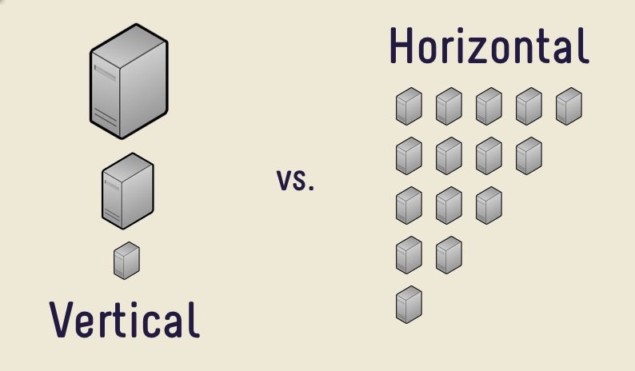
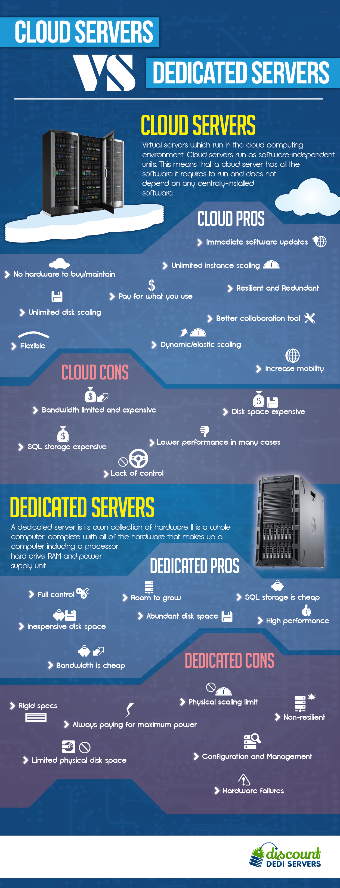

# What is the cloud?

The cloud is just a generic, catch-all term for "someone else's computer". However, the principles behind things like "cloud computing" are important to understand.

## Reasons for the cloud

As the demands placed on applications have grown and the variety of traffic can vary so hugely there was a drive for applications and companies to be able to "scale" to meet demand. There are times with every application that sometimes it will be under more load than at other times.

One example would be Twitch.tv (a streaming website), they always have a rough baseline of traffic but the traffic spikes when there are world tournaments. For instance, during the recent CS:GO FACEIT tournament, there was a peak of nearly 500000 viewers watching the stream, up from an average of 86000 (as of 4th Oct 2018) and thats just one channel. Twitch needs to operate with the capability of suddenly being able to scale to over four times its average viewers. More information can be found [here](https://sullygnome.com/viewers/365).

In previous times, companies would invest in hardware and would host their applications and websites on their own machines. This has advantages but it also has limits. The last thing any company wants is to crash under load, especially as this means that your content is unavailable right at the moment where its in demand.

## What does "scaling" refer to?

Often you might hear the term "scalable" or the phrase "it will/won't scale". Essentially, it boils down to how the functionality will work with increased usage. If you're talking about how something is coded, if it works for the current situation but will become messy or difficult to maintain once its expanded on - its not scalable.

An alternative use is regarding application usage. Everything an application does has a cost. It might be in terms of memory or CPU or diskspace etc. The scalability of the approach is dependant on your capacity of these factors and the expected usage of the application.

An basic example:

Imagine you have an application that performs an action. You're hosting your application on a machine that has 1 GB of memory for its use. Each "individual" request takes 1 second to complete and uses up 200mb of RAM during its execution.

Each time a "user" makes a request to your application your application consumes resources. If only one user requests your application per second, you're fine - you're handling the load you've no reason to "scale up". What happens if 5 people make a request in the same second? Well, 5 x 200mb = 1GB - the machine running your application has no spare memory and best case scenario, the machine has to start swapping memory around to handle the requests - worst case scenario the application crashes because it has no available memory and nobody gets a response.

So! There are a few options here. You either can optimise your functionality to a) complete quicker or b) consume less memory but eventually there's only so much you can do. What next? Well that really depends on you! To me, this is where `vertical` and `horizontal` scaling comes into play. Vertical means increasing the spec of the machine. It has 1GB of memory? Increase it to 2GB - you can now support double the capacity! However, that's only feasible to a certain level. Eventually it becomes too expensive to scale it up any further. The alternative is `horizontal` scaling - adding extra hosts and sharing requests between them all. This has its own complexities however - how do you share requests between the machines? Load balancers? DNS round robin strategies? Both can work and both have their own pros and cons. Feel free to read into both if you're interested.

To wrap up and to summarise - ss before, a picture tells a thousand words:

Courtesy of: http://www.amazinginfographics.com/cloud-vs-dedicated-servers/
