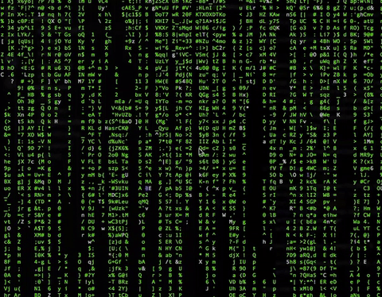
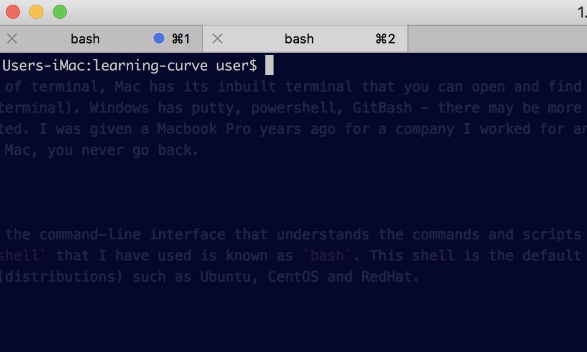

# The Shell

When we refer to the terminal we are referring to this:



Courtesy of: https://github.com/nojvek/matrix-rain

Now obviously I am joking but the terminal is an important foundation of so much of software development. How do you access a computer located somewhere around the world? What if that computer doesn't have a display attached to it? The easiest to connect to it quickly and easily (as long as the machine allows connections) is via the terminal.

Theres many different forms of terminal, Mac has its inbuilt terminal that you can open and find via Spotlight (cmd+space then search for terminal). Windows has putty, powershell, GitBash - there may be more for windows but my knowledge is a little dated. I was given a Macbook Pro years ago for a company I worked for and well, you know what they say - once you go Mac, you never go back.

I personally use [iTerm 2](https://www.iterm2.com/) which is a terminal replacement for Mac as I find it does a lot of things that I now would find difficult not to have. Its very customisable, supports split screen workflows very nicely and is just awesome in general. I'm not sponsored by iTerm (I promise).



You can see in the above screenshot how my iTerm is configured. It tells me the active program in each tab (currently bash as I'm not doing anything in them), it has a slight background opacity as I sometimes will work through tutorials and I can overlay my terminal over the text and read it through the terminal as I type. Everyone can customise their terminal to their liking, I've known colleagues to have solid white background with white text, I've seen background images, I've seen the classic green text on black backgrounds. Each to their own.

## What is the Shell?

The shell is the interface that understands the commands and scripts that a user executes. The most common `shell` that I have used is known as `bash`. This shell is the default for a wide selection of Unix flavours (distributions) such as Ubuntu, CentOS and RedHat.

For comparison, if you started writing some code in a particular language in order for it to actually do something it would need to be run through a process to execute it. For instance, you can write some Javascript code but until its read in by something that understands how to execute it - its just text. `The shell` refers to the particular framework that understands your command line code.

## How do you use it?

The terminal is simple, deliberately so. However you can do some incredible complex tasks via the terminal, often vastly quicker than using a visual interface (a `GUI`). The basic premise is that you perform your required actions through commands (hence `command-line`). These commands can sometimes run without any extra information from you, sometimes they need parameters and sometimes they can take options to alter their inputs and outputs.

Most of commands you'll need are named similar to what they do. For instance, to make a new directory you would type `mkdir new_folder` - `mkdir` reads like "make dir". To move folders or to change directory you would type `cd folder_to_move_to` - `cd` just like `C`hange `D`irectory. To open a new file (at least on Unix like systems) its pretty easy to remember - `open filename`.

Putting it simply, commands are just programs. Anyone can write a command-line utility, there are 1000s of tutorials out there to help you and there are many packages (speaking of Javascript) that help you to build a command line app very easily. 

However, in order to run a command your terminal must know where to find the program. The way your terminal locates these programs is through the `PATH` environment variable. This variable is stored on your computer and is used to "lookup" a program when you run a command. 

My path variable looks like this:

```
/Users/user/.nvm/versions/node/v8.11.1/bin:/usr/local/bin:/usr/bin:/bin:/usr/sbin:/sbin:/Library/Frameworks/Mono.framework/Versions/Current/Commands
```

Breaking this down, this means that when I attempt to run a program my terminal will look to this `$PATH` variable, split it up by the `:` and will then attempt to look in each of the locations in turn for a matching program. So using the above example if I attempt to run the `example` command from my terminal, it will look in each of the following folders:

1) /Users/user/.nvm/versions/node/v8.11.1/bin
2) /usr/local/bin
3) /usr/bin
4) /bin
5) /usr/sbin
6) /sbin
7) /Library/Frameworks/Mono.framework/Versions/Current/Commands

If any of these folders has a program called `example` that can be executed then great. Otherwise, it'll tell you that it doesn't recognise the command and give you an error message something like:

`-bash: example: command not found`

## Concepts

### Home

The terminal has a few concepts that will save you heaps of time in the future. Every system has the concept of a "home" directory. 

Mac locates all the user profiles for the computer in the `/Users/` folder. For instance if there are two individual user accounts with account names of `alex` and `sam` on the machine in question, there will be a `/Users/alex` folder and a `/Users/sam` folder - each of which will have their own `Documents`, `Downloads` etc

In the terminal, if you want to change directory to the home directory of the current user theres a nice handy shortcut - `~`. This is known as a "tilde" and when used always references the home directory of the currently logged in user. For example, if I am logged in as the `sam` user account then `~` will be the exact same as `/Users/sam`.

### Folder Navigation

When dealing with paths, there are really only a few things to keep in mind. I've already mentioned the `~` character but there are a few other special characters that are useful.

* Single dot - `.` - this references the current location. For instance, many code editors have command line shortcuts that allow you to open a file or folder easily from the command line. This is often a lot quicker than opening the editor outside the terminal, going to file -> open, locating your project folder and opening that way. If you're already in your project folder you can reference it with a `.` - for Visual Studio code, its as 
simple as `code .` - this basically means "open visual studio code for the current folder".

* Double dot - `..` - this references the folder "above" where you currently are. For example, if you organise your projects into different folders and want to move between the projects its often much easier to just navigate up out your current project and "down" into another. 
  * Continuing this example, if you had your projects organised `/my/work/Projects/first` and `/my/work/Projects/second`, if you were currently in the folder for "second" and wanted to move to the folder for the "first" project you would simply go up out of second and down into "first".

The following commands end up with the same result:

1) `cd /my/work/Projects && cd first`
2) `cd /my/work/Projects/first`
3) `cd ../first`

Since the last is substantially shorter, thats my preference (imagine how many keystrokes you're saving your hands over the period of your career!)

### Dollars

In the shell (at least in `BASH`), the dollar symbol is how you reference a variable. If I define a variable in `BASH` like `NAME=alex`, if I wanted to check or use that NAME variable I would have to add a `$` before it - otherwise the shell will think its a program and try to execute it.

### Piping

I'm not sure if this is the correct term for it but its what I call it and other developers I've worked with have known what I mean when I said it so I'll carry on assuming its the correct term! With the command-line, you can pass the results of a command directly into another command very easily via "piping".

One such use case if if you were watching the application logs of an application but was only interested in particular entries. Using a combination of whatever command you're using to watch the logs and `grep` this is a super simple task. 

## Common Commands


* `ls` - list
  * Does what it says on the tin, when you type `ls` and press enter - the terminal will look in your current directory and will return you all the files and directories it can find.
  * You can also tell `ls` to list the contents of a different location by passing that location in. For example `ls /some/other/folder` will look for the `/some/other/folder` directory and will list everything it finds within that.
  * You can also alter the output of the command by passing it options (often known as `flags`) which can be combined.
    * `ls -l` will return the contents as a list.
    * `ls -lt` will return the results as a list sorted by the last edited time.
    * `ls -ltr` will return the results as a list sorted by the last edited time in reverse (most recent at the bottom).
    * `ls -ltra` will return ALL (including hidden) results as a list sorted by the last edited time in reverse (most recent at the bottom).
* `cd` - change directory
  * Example: `cd ~` - change directory to my user's home directory.
* `open` - open file / folder with the associated program.
  * Example: `open ~/Downloads` - open up my user's Downloads directory. Since this location is a directory, it'll open up the Explorer in Windows and the Finder in Mac.
  * Example: `open ~/Downloads/somefile.txt` - It will detect this is a `.txt` file and will open up the configured editor for this type of file on your computer.
* `echo` - print out something. If we have a variable called `NAME`, we could print the value by running `echo $NAME`.
* `grep` - search for a term. `grep` is a very useful tool that comes in handy more often than you'd think. It can be supplied parameters to help search such as `grep "search term" filename` or it can even be piped information for it to search / filter.
* `tail` - will "follow" a file and will update if that file changes. For instance, if your application is adding new information to a text file every few seconds, you could `tail` that file and every time your app adds new data to the file it will show up while you are tailing it.

## A Practical Example

For this example, I've put together a `BASH` script that outputs the time once a second and will randomly print out a sample "error" log. Now if we were monitoring the output for this, we don't really care about the logs that contain the time information - we want to see the error logs!

Just before we start - in general **NEVER** just execute a shell script that a stranger has told you to execute. If you have enough permissions on your machine the script could do *incredible* amounts of damage to your machine - for example `rm -rf /` would wipe out every single file on your computer - **including all system files such as your operating system**. Please feel free to inspect the script and ensure it does what I'm saying it does.

If you take a look at [spammy.sh](spammy.sh), you can see that it will infinitely loop. We can run this by navigating to this folder in the terminal and running `./spammy.sh`. It's important to note the `./` before the filename, that's telling the terminal that the file is in the current folder (because of the `.` and the `/` meaning inside that folder).

You should start to see the "logs" be printed out to your screen. There should be the time printed every second and intermittent "errors" spaced around randomly. However, since we're only really interested in the error logs, we're going to "pipe" the output of `spammy.sh` into `grep`. This sounds more complicated than it really is - its as simple as:

```
./spammy.sh | grep Error
```

You can see, we're still running the script the same way and we're grepping (searching / filtering) for the "Error" string to only return results that contain "Error". The difference is we've "joined" them with a `|` character. This is called a "bar" and essentially passes the output from the first command to the second command. This simple trick can be very, very useful if you're monitoring the logs of a busy application - imagine if your app is sending out 100s logs per second? 
